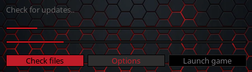
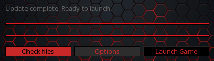

# Game Client Updater

## Overview
The **Game Client Updater** is a Qt-based application designed to manage updates for the game client. It provides functionalities for checking for updates, downloading missing or updated files, and launching the game client. This project demonstrates the use of Qt Widgets, Network, and resource management to implement a modern updater.

## Features
- Checks for game updates by comparing local and server versions.
- Downloads updated or missing files listed in a server-side manifest.
- Displays real-time download progress and overall update status.
- Ensures file integrity using MD5 checksums.
- Launches the game client once updates are complete.

---

## Project Structure

```
game-client-updater/
├── CMakeLists.txt        # CMake configuration for building the project
├── main.cpp              # Entry point for the application
├── neon.webp             # Background image resource
├── res.qrc               # Qt resource file
├── updater.cpp           # Implementation of the Updater class
├── updater.h             # Header file for the Updater class
└── updater.ui            # UI definition for the Updater class
```

---

## Getting Started

### Prerequisites
- **C++ Compiler** with C++17 support.
- **Qt 6.5 or later** with Core, Widgets, and Network modules.
- **CMake 3.19 or later**.

### Building the Project

```bash
Not implemented..
```
---

## Usage

1. Launch the updater application.
2. The updater automatically checks for updates from the server.
3. If updates are available:
    - The updater downloads and applies them.
    - The progress is displayed via two progress bars (download and overall).
4. Once updates are complete, click the **Launch Game** button to start the game client.

---

## Configuration

### Server Setup
- **SERVER_URL**: The base URL for the update server (defined in `updater.cpp`).
- **Files Required on the Server**:
    - `version.txt`: Contains the latest version number (e.g., `1.0.0`).
    - `manifest.txt`: Lists files to update in the format `<filename>:<md5>:<size>`.
    - Patch files located in the `patch/` directory.

### Modifying UI
Edit `updater.ui` using the Qt Designer tool to customize the interface.

---

## Technical Details

### Key Classes and Methods

#### `Updater` Class
- **checkForUpdates()**: Compares local and remote version numbers.
- **downloadUpdate()**: Fetches the manifest and initiates file downloads.
- **calculateMd5(QFile &)**: Calculates the MD5 checksum of a file to verify integrity.
- **launchGame()**: Starts the game executable after ensuring it's ready.

#### Resource Management
- **res.qrc**: Defines embedded resources such as the background image `neon.webp`.

#### Build System
- **CMakeLists.txt**: Configures project dependencies, builds resources, and generates deployment scripts.

---

## Troubleshooting

### Common Issues
1. **Network Errors**:
    - Ensure the update server is accessible and correctly configured.
    - Check the `SERVER_URL` in `updater.cpp`.

2. **MD5 Mismatch**:
    - Verify the integrity of files on the server.
    - Recalculate MD5 checksums for the manifest.

3. **Executable Permissions**:
    - Ensure the game executable (`L2.exe`) has the correct permissions on the filesystem.

---

## Screenshots

**Update in Progress**



**Update Complete**



---

## Acknowledgments
Special thanks to the Qt community for their support and resources.

